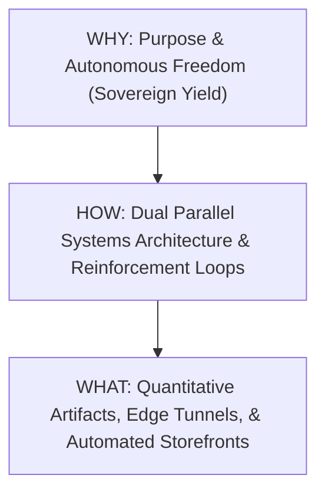
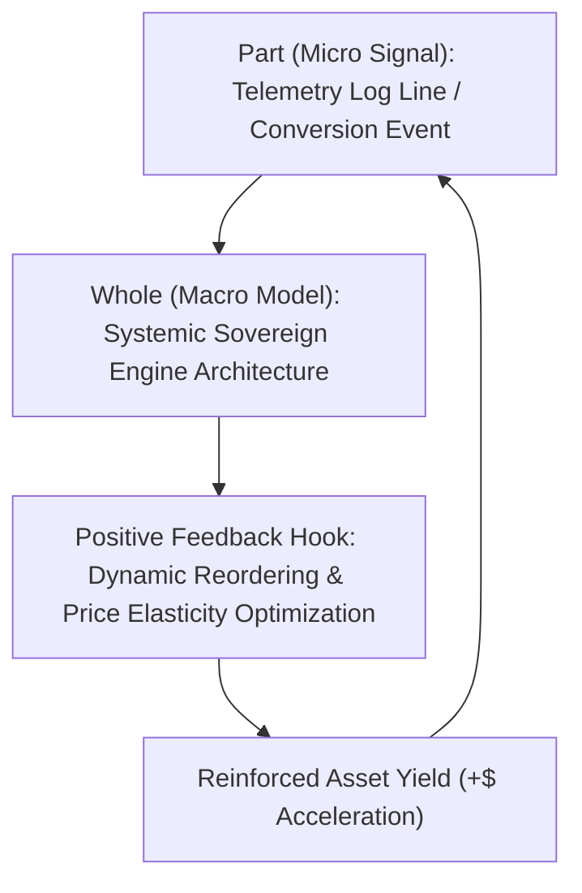

# Dual-Track Parallel Processing & Hermeneutic Synthesis Model
**Framework**: Golden Circle Logic $\otimes$ Positive Feedback Reinforcement Loop $\otimes$ Hermeneutic Iteration  
**Domains**: Computational Data Science $\times$ Strategic Business Administration  
**Target Outcome**: Maximum Yield Elasticity ($+\$$) via Zero-Marginal-Cost Autonomous Execution

---

## 1. The Golden Circle Logic Template (Purpose, Process, Product)



### I. WHY (Strategic Imperative & Value Proposition)
- **Data Science Lens**: To minimize empirical variance in conversion probabilities while asymptotic marginal compute cost approaches zero ($\lim_{\Delta q \to \infty} MC = \$0.00$).
- **Business Administration Lens**: To establish a self-sustaining sovereign capital allocation engine that maximizes lifetime value (LTV) per asset while eliminating operational friction, manual labor churn, and parasitic fixed overhead.

### II. HOW (Systems Architecture & Continuous Methodology)
- Dual parallel execution streams operating under positive feedback loops and hermeneutic part-to-whole analytical iteration.

### III. WHAT (Concrete Empirical Artifacts)
- Unified Local Origin (`http://127.0.0.1:8080`), Cloudflare Zero Trust Conduit, 447-item Dynamic Catalog Grid, Puppeteer Stealth Webhook Automator, FastMCP Tool Hub, and JSON Lines Telemetry Auditor.

---

## 2. Dual Parallel Processing Architecture

The operational state executes across two synchronous, decoupled processing threads:

```mermaid
graph LR
    subgraph Track A: Quantitative Data Science
        A1["Telemetry Data Stream (system.jsonl)"] --> A2["Stochastic Conversion Modeling"]
        A2 --> A3["Automated Delta Catalog Parsing"]
    end
    subgraph Track B: Strategic Business Administration
        B1["Asset Monetization (Digital WAVs/Stems)"] --> B2["Channel Compression (Single Origin)"]
        B2 --> B3["Capital Allocation & Yield Reinvestment"]
    end
    Track A <-->|"Positive Feedback Hook"| Track B
```

### Track A: Computational Data Science & Automated Analytics
1. **Stochastic Telemetry & Event Ingestion**:
   - Ingest real-time JSON Lines (`logs/system.jsonl`) recording network connection events, card rendering latencies, and conversion triggers.
2. **Deterministic Delta Parsing**:
   - Automated catalog script (`scripts/generate-catalog.js`) scans `C:\Users\Jinx\Music\Suno_DistroKid_Releases`, identifying unindexed directory deltas ($\Delta N$) and mapping raw audio/metadata into `public/catalog.json`.
3. **Edge Optimization & Latency Control**:
   - Local binding constrained to `127.0.0.1:8080`; RAM allocation monitored against a 50% soft ceiling to ensure computational headroom.

### Track B: Strategic Business Administration & Commercial Leverage
1. **Asset Leverage & Inventory Illumination**:
   - Transform static sonic releases into permanent, zero-fulfillment digital inventory (uncompressed WAV masters, stem packs, and HyperFollow discovery cards).
2. **Channel Compression**:
   - Collapse streaming discovery (DistroKid HyperFollow) and direct monetization (Shopify Buy Containers) onto a single origin and unified domain (`jinxmp3.com`).
3. **Marginal Revenue Acceleration**:
   - Fixed operational expenditure is fixed at $\$0.00$; revenue streams compound predictably across streaming royalties, direct digital stem downloads, and micro-task API calls.

---

## 3. Hermeneutic Reasoning Cycle & Positive Feedback Hook



### The Hermeneutic Circle (Part-to-Whole Iterative Refinement)
- **The Part (Micro)**: Individual telemetry entries, missing HyperFollow links, or single release conversion clicks.
- **The Whole (Macro)**: The overarching sovereign cash-flow system ($S_6$).
- **The Iterative Interpretation**:
  1. Micro-level telemetry signals are evaluated against macro-level financial yield targets ($+\$$).
  2. Discrepancies (e.g., unindexed releases or stopped tunnel services) trigger immediate self-correction routines (`scripts/reinstall-tunnel.ps1`).
  3. Corrective actions refine the whole system, driving continuous alignment between local execution and strategic objectives.

### The Positive Feedback Loop Hook
$$\text{Yield Acceleration} = f(\text{Asset Volume}, \text{Channel Compression}, \text{Zero Marginal Cost})$$

1. **Signal Capture**: Page views, HyperFollow clicks, and digital download checkouts write timestamped events to `logs/system.jsonl`.
2. **Automated Analysis**: Telemetry parsing identifies top-converting releases and high-demand stem prompts.
3. **Dynamic Re-allocation**: Front-end card hierarchy (`public/app.js`) dynamically elevates top-converting assets to prime grid positions.
4. **Yield Reinvestment**: Compounding positive returns ($+\$$) reinforce personal freedom, mental clarity, and digital host autonomy.

---

## 4. Academic Vocabulary Index

| Domain | Key Term | Academic Definition & System Application |
| :--- | :--- | :--- |
| **Data Science** | *Stochastic Telemetry* | Real-time logging of probabilistic events (`system.jsonl`) for empirical conversion tracking. |
| **Data Science** | *Delta Ingestion* | Deterministic parsing of newly added release folders without full-catalog recomputation. |
| **Data Science** | *Asymptotic Marginal Cost* | System design where cost per additional unit served approaches zero ($\lim_{\Delta q \to \infty} MC = 0$). |
| **Business Admin** | *Channel Compression* | Consolidating disparate sales/analytics channels into one origin surface (`127.0.0.1:8080`). |
| **Business Admin** | *Asset Leverage* | Converting sunk creative effort into permanent, continuously illuminated digital inventory. |
| **Business Admin** | *LTV Optimization* | Maximizing lifetime value per sonic asset via zero-fulfillment high-margin digital stem packs. |
| **Hermeneutics** | *Part-to-Whole Synthesis* | Continuously evaluating individual telemetry events to optimize overall system architecture. |
| **Systems Model** | *Positive Feedback Loop* | Closed-loop reinforcement where asset yield dynamically boosts system position and autonomy. |

---

## 5. Verification & Immutable Sync

- **Operational Checkpoint**: Logged in [`CHECKPOINT_STATE.txt`](file:///C:/Users/Jinx/projects/jinxmp3-site/CHECKPOINT_STATE.txt).
- **Git Ledger**: Committed and pushed to [https://github.com/guiceatk/jinxmp3-site](https://github.com/guiceatk/jinxmp3-site).
